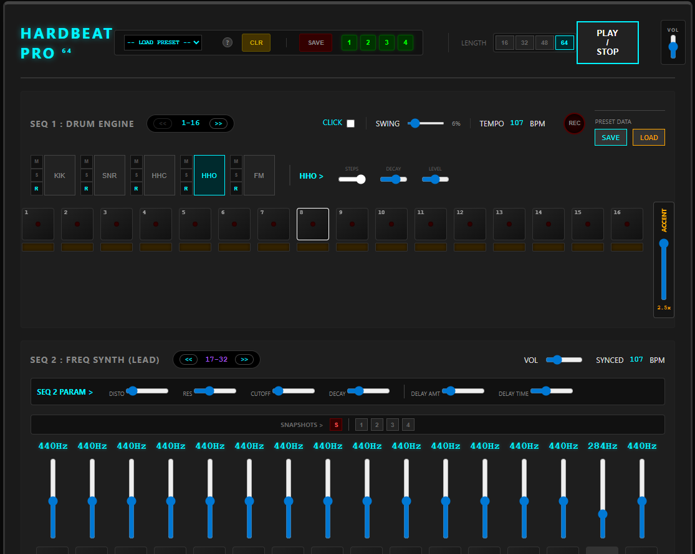

#  HARDBEAT PRO (V12 GOLD)
> **Browser-Based Hardgroove Workstation**


**Hardbeat Pro** est une boîte à rythmes et un synthétiseur techno tournant entièrement dans le navigateur. Conçue pour la performance live et la composition de **Hardgroove** et de **Techno Industrielle**, elle se distingue par son moteur audio natif à faible latence et sa gestion avancée de la polyrythmie.


<br>
<div align="center">
  
</div>
<br>

🔗 **[LANCER L'APPLICATION (LIVE DEMO)](https://binokub.github.io/HARDBEAT-DEV/HARDBEAT-PRO.html)**
📘 **[OUVRIR LE MANUEL (HANDBOOK)](https://binokub.github.io/HARDBEAT-DEV/manual.html)**

---

# 🎹 HARDBEAT PRO (V13)
> Le Séquenceur Techno Web Ultime. Basses lourdes, rythmes complexes et persistance des données.

[Lien vers l'Application V13](https://binokub.github.io/HARDBEAT-DEV/HARDBEAT-PRO.html)

---

## 📅 NOUVEAUTÉS V13 (Gold)
**Date :** 29 Janvier 2026
* **💾 Système I/O (Input/Output) :** Sauvegarde et Chargement complet des presets.
* **📂 Format JSON :** Les utilisateurs téléchargent leur propre fichier de sauvegarde.
* **⚙️ Moteur Audio :** Synchronisation totale entre le fichier importé et le moteur audio (BPM, Swing, Séquences).
* **🛡️ Sécurité :** Protection anti-crash sur le BPM (Clamping 40-300).

---

## 📖 MANUEL UTILISATEUR

### Comment sauvegarder ma musique ?
Hardbeat Pro V13 vous permet de sauvegarder vos performances localement. Aucune donnée n'est envoyée dans le cloud, tout reste sur votre machine.

1.  **Sauvegarder (SAVE) :**
    * Cliquez sur le bouton **SAVE** (Cyan).
    * Un fichier `HARDBEAT_[date].json` est téléchargé.
    * Il contient tout : Tempo, Notes, Fréquences, Swing.

2.  **Charger (LOAD) :**
    * Cliquez sur le bouton **LOAD** (Orange).
    * Sélectionnez votre fichier `.json`.
    * La machine se met à jour instantanément.

> **Astuce Pro :** Vous pouvez charger un preset d'usine, le modifier légèrement, et le sauvegarder sous un nouveau nom sur votre ordinateur.

---

## 🛠️ DOCUMENTATION TECHNIQUE (Pour les Développeurs)

### Architecture I/O (`io.js`)
Le système d'import/export fonctionne en isolation pour garantir la stabilité.

**Structure du JSON :**
```json
{
  "version": "V13",
  "bpm": 138,
  "swing": 0,
  "drums": { "seq": [...], "accents": [...] },
  "synths": { "seq2": [...], "freqs2": [...] }
}
Moteur Audio (logic.js) :
Depuis la V13, le moteur expose window.bpm pour permettre le pilotage externe par le module d'importation.

© Crédits
Développé par Binokub - 2026
